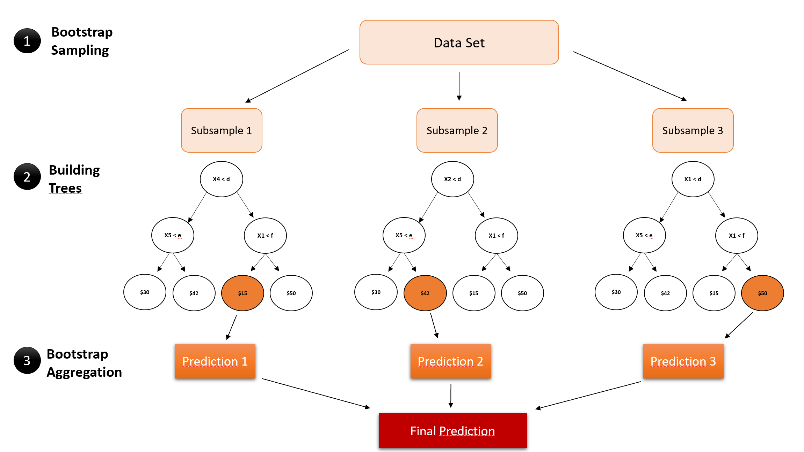

```{r setup, include=FALSE}
knitr::opts_chunk$set(echo = FALSE)
```

## Agenda
1. Introduction
2. Data gathering & cleaning
3. Descriptive statistics
4. Linear Regressions (CPU&GPU)
5. XGBoost
6. Points of further consideration

## Introduction (1/2)

The 2020 US-Presidential election led to the highest voter turnout in history

<center>

**Donald Trump Vs. Joe Bidden**


<center>

## Introduction (2/2)

### **Why was the interest in the election that high?**

There was a clash of different socio-economic groups:

<center>
<font size="-0.3">

Conservative vs. Liberal

Urban vs. Rural

Climate Protectionists vs. Climate Change Deniers

Young vs. old

</font>
</center>

But are those socio-economic gaps also visible when it comes to the American's love for big cars?


## Research question
<center>

### Do car characteristics have any predictive power for the US-presidential voting outcome?


<center>
## Data gathering(1/3)
### **Two data samples were used**

1. Used Car dataset ***(Kaggle)***
    <font size="-0.3">
    
    + 3 million cars that were listed on Cargurus as of Sept. 2020
    + Each car was reported with 66 characteristics
    + resulting in a total of ~200 million data points
    
    </font>
  **Total file size of ~9.3GB**

2. Precinct level voting outcome in the 2020 US-presidential election ***[MIT Election Lab]***
<font size="-0.3">

    + Voting outcome in xx states and xx counties
    + Number of votes for republican, democrat and other Presidential candidates
   
    </font>
  **Total file size of 0.2GB**

## Data merging (2/3)
In a second step, the two data sets were merged

**Problem:** 

<center>

county level voting data vs. longitudonale/lattitudonale or ZIP code level car data

</center>

**Solution:**

1. Package 'jvamisc' retrieved from github to map latitudinal & longitudinal car data to specific county
2. Add county voting outcome to each car data
3. Full data set constructed

**Output**: Cars data and Democratic to republican ratio in one df

## Data cleaning (3/3)

Two step cleaning approach

1. **Strain Splitting** and **variable type definition** 
2. Visually identified **Outliers** were excluded with an ff out-of-memory approach
<font size="-0.3">

  * city fuel economy < 70 miles per gallon
  * highway fuel economy < 60 miles per gallon
  * Horsepower < 600
  * Price < 200'000 $
  * Mileage < 300'000 miles
  * rpm (revolutions per minute) < 2000
  * Savings Amount < 2500
  * year > 1900
 
## Linear regressions: The sample in use

1. Omit unnecessary dependent variables
    <font size="-0.3">
    - e.g. longitudinale and latitudinale data was ecluded after merching
    </font>
2. **Conceptional exclusion**
    <font size="-0.3"> 
    - heavily multicollinear independent variables (e.g. hp vs. rpm)
    - Non-distinctional car characteristic were excluded
    e.g. color??
    </font>

### **Dependent variable:** 
* democratic to republican voter outcome

<center>

$\frac{democraticvotes}{democratic votes + republican votes}$

</center>

### **Independant variables:** 
<style>
  .col2 {
    columns: 2 200px;         /* number of columns and width in pixels*/
    -webkit-columns: 2 200px; /* chrome, safari */
    -moz-columns: 2 200px;    /* firefox */
  }
  .col3 {
    columns: 3 100px;
    -webkit-columns: 3 100px;
    -moz-columns: 3 100px;
  }
</style>
<font size="-0.5">
<div class="col2">
* Is new (if car is new or pre-owned)
* Price
* Fuel economy city (fuel consumption in the city)
* Mileage 
* Horsepower
* Length 
* Max seating
* Body type
* Brand name
* State
</div>
</font>
    
## GPU & CPU results overview

GPU more efficient than CPU

    - package 'GPUtools' was used
    - CUDA for INVIDIA GPUs

```{r, figures-side, fig.show="hold", out.width="50%"}
par(mar = c(4, 4, .1, .1))
plot(cars)
plot(mpg ~ hp, data = mtcars, pch = 19)
```

## XGBoost: Concept
Gradient boosted tree-concept deriving predictions from bootstrap aggregation
<center>
{width=75%}
</center>

## XGBoost: Results

```{r cars, echo = FALSE}
# quick plot of NAs
# count_nas <- (as.numeric(lapply(physical(carListingsClean), FUN=function(x) sum(is.na(x))))/nrow(carListingsClean)) %>%
# #   'names<-'(names(carListingsClean))
# # sorted <- rev(sort(count_nas))
# # barplot(sorted, cex.names = 0.5, las = 2)
# title(main = '% NAs in used cars data')
```


## Visualisation: 

## Sources of Data

https://github.com/MEDSL/2020-elections-official
https://www.kaggle.com/ananaymital/us-used-cars-dataset


