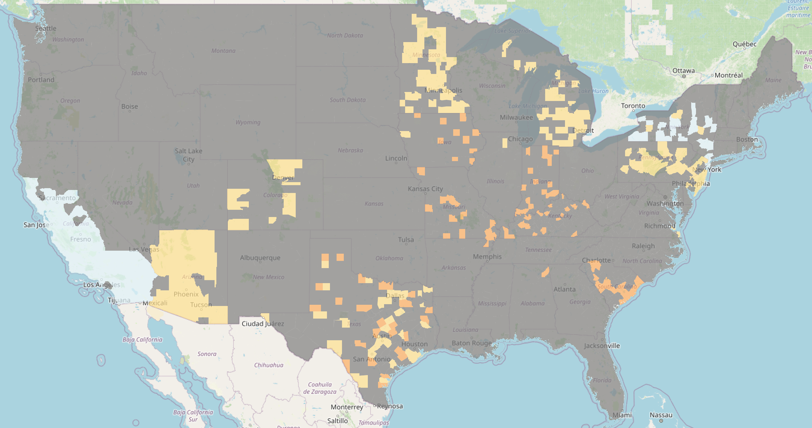

```{r setup, include=FALSE}
library(data.table)
library(data.table)
library(leaflet)
library(mapview)
library(raster)
library(leaflet.providers)
library(leaflet.extras)
knitr::opts_chunk$set(echo = FALSE)


# Load some files
ols.coefficients <- readRDS(file = "Pictures_presentation/OLSOutput.rds")
performance_metrics <- readRDS(file = 'Pictures_presentation/performance_metrics.rds')

# Dem Rep Ratios that are available
DemRepRatiosAvailable <- fread('models/DemRepRatiosAvailable.csv')

# XGB Forecast
DemRepRatiosXGBForecast <- fread('models/xgb_forecast.csv')

# Function to plot
plotUSVotingData <- function(dataset){
  # Get USA polygon data
  USA <- getData("GADM", country = "usa", level = 2)
  USA@data$NAME_0 <- as.character(lapply(USA@data$NAME_0, tolower))
  USA@data$NAME_1 <- as.character(lapply(USA@data$NAME_1, tolower))
  USA@data$NAME_2 <- as.character(lapply(USA@data$NAME_2, tolower))
  
  # Append data
  temp <- merge(USA, dataset,
                by.x = c("NAME_1", "NAME_2"), by.y = c("state", "county"),
                all.x = TRUE)
  
  # Create a color range for the markers
  pal.quantile <- colorQuantile("RdYlBu", domain =  c(0,1), reverse = FALSE, n = 10)
  mypal <- pal.quantile(temp$DemRepRatio)
  
  # Create the leaflet map
  map <- leaflet() %>% 
    addProviderTiles("OpenStreetMap.Mapnik") %>%
    setView(lat = 39.8283, lng = -98.5795, zoom = 4) %>%
    addPolygons(data = USA, stroke = FALSE, smoothFactor = 0.2, fillOpacity = 0.7,
                fillColor = mypal,
                popup = paste("Region: ", temp$NAME_2, "<br>",
                              "Value: ", round(temp$DemRepRatio,3), "<br>")) %>%
    addLegend(position = "bottomleft", pal = pal.quantile, values = c(0,1),
              title = "Value",
              opacity = 1)

# Return map
return(map)
}

# Create map
names(DemRepRatiosXGBForecast) <- c('state', 'county', 'DemRepRatio')

# Combine observed with forecasts
DemRepRatiosFullMap <- rbind(DemRepRatiosXGBForecast[,c('state', 'county', 'DemRepRatio')], DemRepRatiosAvailable)

map <- plotUSVotingData(DemRepRatiosFullMap)


```

## Agenda
1. Introduction
2. Data gathering, cleaning & descriptives
3. Methodology
4. Linear regression and XGBoost results
5. XGBoost forecast

## Introduction

The 2020 US-Presidential election led to highest voter turnout in history due to clash of socio-economic groups and ideologies:

<center>

### **Donald Trump Vs. Joe Bidden**

<font size="-0.3">

Conservative vs. Liberal

Urban vs. Rural

Climate Protectionists vs. Climate Change Deniers

Young vs. old

</font>
</center>

But are those socio-economic gaps also visible when it comes to the American's love for big cars?


## Research question
<center>

### Do car characteristics have any predictive power for the US-presidential voting outcome?


<center>
## Data gathering(1/2)
### **Two data samples were used**

1. Used Car dataset ***(Kaggle):*** loaded with an out-of-memory approach using the ff-package to store data chunks of 100k observations at a time
    
    <font size="-0.3">
    
    + 3 million cars listed on Cargurus as of Sept. 2020 in 1338/3006 counties
    + Each car reported with 66 characteristics
    + resulting in a total of ~200 million data points
    
    </font>
  **Total file size of ~9.3GB**

2. Two data sets for the voting outcome on a precinct- and state level ***(MIT Election Lab)***

    <font size="-0.3">

    + Voting outcome of 1427/3006 counties in 30/50 states
    + Split of votes for all Presidential candidates per jurisdiction
   
    </font>
  **Total size for both files ~0.2GB**

## Data merging and cleaning (2/2)

### **Merging:**


Problem : county level voting data vs. latitudonal & longitudona level car data


Solution: package 'jvamisc' maps latitudinal & longitudinal car data to county

### **Cleaning approach**

1. Omitting variables with >20% NAs
2. String splitting, variable type definition and data type setting
3. Outliers were excluded by visual identification
    <style>
  .col2 {
    columns: 2 200px;         /* number of columns and width in pixels*/
    -webkit-columns: 2 200px; /* chrome, safari */
    -moz-columns: 2 200px;    /* firefox */
  }
  .col3 {
    columns: 3 100px;
    -webkit-columns: 3 100px;
    -moz-columns: 3 100px;
  }
  </style>
  <font size="-0.3">
  <div class="col2">
    - city fuel economy < 70 miles per gallon
    - highway fuel economy < 60 miles per gallon
    - Horsepower < 600
    - Price < 200'000 $
    
    - Mileage < 300'000 miles
    - rpm (revolutions per minute) < 2000
    - Savings Amount < 2500
    - year > 1900
  </div>
  </font>


## The sample in use (1/2)

### **Dependent variable:**
* democratic to republican voter outcome

<center>

$\frac{democratic\:votes}{democratic\:votes + republican\:votes}$

</center>
### **Independant variables:**
<style>
  .col2 {
    columns: 2 200px;         /* number of columns and width in pixels*/
    -webkit-columns: 2 200px; /* chrome, safari */
    -moz-columns: 2 200px;    /* firefox */
  }
  .col3 {
    columns: 3 100px;
    -webkit-columns: 3 100px;
    -moz-columns: 3 100px;
  }
</style>
<font size="-0.5">
<div class="col2">
* State democratic to republican voter outcome (factor)
* Is new (if car is new or pre-owned)
* Price
* Fuel economy city (fuel consumption in the city)
* Mileage
* Horsepower

* Length
* Max seating
* Body type (factor)
* Brand name (factor)
* State (factor)
</div>
</font>
--> **Total sample size:** 2.6mio observations

## Sample in use (2/2)


<center>

{width=92%}
</center>


## Analytical approaches

**Linear regression:** normalized values were used
  
  - on CPU
  - on GPU
    - gpuLm function from package 'GPUtools'
    - CUDA for NVIDIA GPUs *(downfall: does not work on other GPUs)*

**XGBoost:** gradient boosting tree-technique using parallelization of computation by default & deriving predictions from bootstrap aggregation

  - In RAM with approximated solutions ("hist" method)
    - Parallelized hyperparameter optimization
  - Out-of-Memory ("hist" method)


## Robust linear regression coefficients 

```{r mysize=TRUE, size='tiny'}
ols.coefficients
```

## XGBoost feature importance plot
<center>
{width=70%}
</center>
## Results of the two prediction algorithms

The data set was split into a training set (75% of observations) and a sample set (25% of observations)

```{r mysize=TRUE, size='tiny'}
performance_metrics
```

## Forecast with XGBoost

Prediction of Dem_Rep_Ratio only for counties where results were not yet fully processed by the MIT election lab

<center>
```{r}
map
```
</center>

## Sources of Data

* US Used cars dataset: https://www.kaggle.com/ananaymital/us-used-cars-dataset
* MIT Election Lab Voting Data: https://github.com/MEDSL/2020-elections-official
* State Level Election Outcome: https://dataverse.harvard.edu/dataset.xhtml?persistentId=doi:10.7910/DVN/42MVDX

# Appendix

## XGBoost: Concept
<center>
{width=75%}
</center>

## Results with linear regression

<center>

{width=92%}
</center>

## Actual vs. predicted values (Linear)

<center>

{width=70%}

</center>

## Actual vs. predicted values (XGBoost)

<center>

{width=70%}
</center>


## XGBoost number of trees optimization
<center>

{width=70%}
</center>

## XGBoost top 1 variable

<center>

{width=70%}
</center>

## XGBoost top 2 variable

<center>

{width=70%}
</center>

## XGBoost top 3 variable

<center>

{width=70%}
</center>