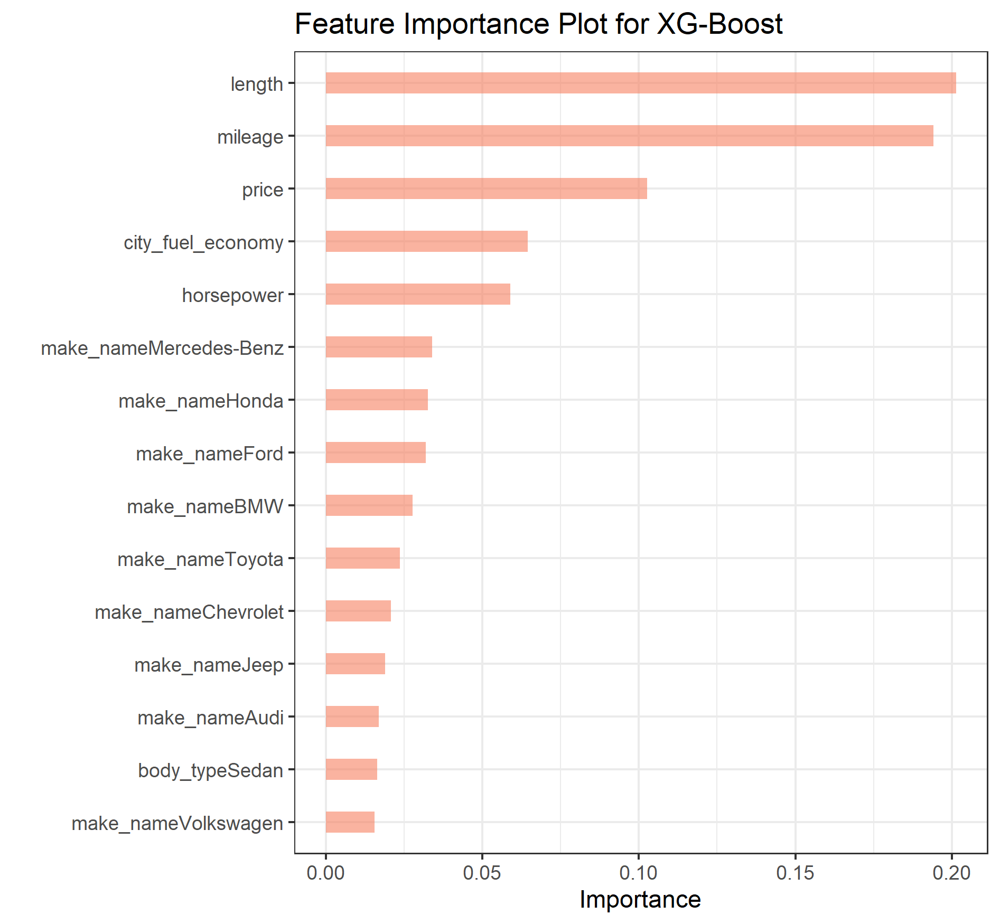

```{r setup, include=FALSE}
library(data.table)
knitr::opts_chunk$set(echo = FALSE)

# Load some files
ols.coefficients <- readRDS(file = "Pictures_presentation/OLSOutput.rds")
performance_metrics <- fread('models/performance_metrics.csv')
map <- readRDS(file = "Pictures_presentation/MapComplete.rds")

```

## Agenda
1. Introduction
2. Data gathering & cleaning
3. Descriptive statistics
4. Analytical approaches
5. Linear regression coefficients
6. XGBoost parameter importance
7. Results with XGBoost prediction

## Introduction

The 2020 US-Presidential election led to highest voter turnout in history due to clash of socio-economic groups and ideologies:

<center>

### **Donald Trump Vs. Joe Bidden**

<font size="-0.3">

Conservative vs. Liberal

Urban vs. Rural

Climate Protectionists vs. Climate Change Deniers

Young vs. old

</font>
</center>

But are those socio-economic gaps also visible when it comes to the American's love for big cars?


## Research question
<center>

### Do car characteristics have any predictive power for the US-presidential voting outcome?


<center>
## Data gathering(1/2)
### **Two data samples were used**

1. Used Car dataset ***(Kaggle):*** loaded with an out-of-memory approach using the ff-package to store data chunks of 100k observations at a time
    
    <font size="-0.3">
    
    + 3 million cars xlisted on Cargurus as of Sept. 2020 in 1338/3006 counties
    + Each car reported with 66 characteristics
    + resulting in a total of ~200 million data points
    
    </font>
  **Total file size of ~9.3GB**

2. Two data sets for the voting outcome on a Precinct level and on a State level ***[MIT Election Lab]***

    <font size="-0.3">

    + Voting outcome of 1427/3006 counties in 30/50 states
    + Split of votes for all Presidential candidates per jurisdiction
   
    </font>
  **Total size for both files ~0.2GB**

## Data merging and cleaning (2/2)

### **Merging:**


Problem : County level voting data vs. longitudonale/lattitudonale level car data


Solution: Package 'jvamisc' maps latitudinal & longitudinal car data to county

### **Cleaning approach**

1. Strain splitting, variable type definition and data types were set
2. Visually identified outliers were excluded with an ff out-of-memory approach
    <style>
  .col2 {
    columns: 2 200px;         /* number of columns and width in pixels*/
    -webkit-columns: 2 200px; /* chrome, safari */
    -moz-columns: 2 200px;    /* firefox */
  }
  .col3 {
    columns: 3 100px;
    -webkit-columns: 3 100px;
    -moz-columns: 3 100px;
  }
  </style>
  <font size="-0.3">
  <div class="col2">
    - city fuel economy < 70 miles per gallon
    - highway fuel economy < 60 miles per gallon
    - Horsepower < 600
    - Price < 200'000 $
    
    - Mileage < 300'000 miles
    - rpm (revolutions per minute) < 2000
    - Savings Amount < 2500
    - year > 1900
  </div>
  </font>


## The sample in use (1/2)

### **Dependent variable:**
* democratic to republican voter outcome

<center>

$\frac{democratic\:votes}{democratic\:votes + republican\:votes}$

</center>
### **Independant variables:**
<style>
  .col2 {
    columns: 2 200px;         /* number of columns and width in pixels*/
    -webkit-columns: 2 200px; /* chrome, safari */
    -moz-columns: 2 200px;    /* firefox */
  }
  .col3 {
    columns: 3 100px;
    -webkit-columns: 3 100px;
    -moz-columns: 3 100px;
  }
</style>
<font size="-0.5">
<div class="col2">
* Is new (if car is new or pre-owned)
* Price
* Fuel economy city (fuel consumption in the city)
* Mileage
* Horsepower

* Length
* Max seating
* Body type
* Brand name
* State
</div>
</font>
--> **Total sample size:** 2.6mio observations

## Sample in use (2/2)


<center>

{width=92%}
</center>


## Analytical approaches

**Linear regression** 
Normalized values were used
  
  - on CPU
  - on GPU
    - gpuLm function from package 'GPUtools'
    - CUDA for INVIDIA GPUs *(downfall: does not work on other GPUs)*

**XGBoost**
Gradient boosting tree-technique using parallelization of computation by default & deriving predictions from bootstrap aggregation

  - In RAM with approximated solutions ("hist" method)
  - Out-of-Memory


## Linear regression coefficients and robustness

```{r mysize=TRUE, size='tiny'}
ols.coefficients
```

## XGBoost parameter importance plot
<center>
{width=40%}
</center>
## Train Test

Show table here with R^2 etc. of train and test samples for both methodologies
```{r mysize=TRUE, size='tiny'}
performance_metrics
```

## Results with XGBoost prediction

Show map with final prediction outcome by XGBoost estimator
```{r}
map
```

## Sources of Data

https://github.com/MEDSL/2020-elections-official
https://www.kaggle.com/ananaymital/us-used-cars-dataset


## XGBoost: Concept
<center>
{width=75%}
</center>

## Results with linear regression

Show map with final prediction outcome by linear estimator 


## Actual vs. predicted values (Linear)

## Actual vs. predicted values (XGBoost)

<center>

{width=50%}
</center>

## XGBoost number of trees optimization


